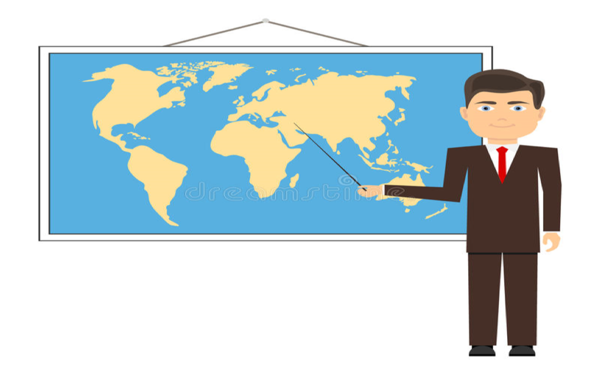

# Mapping Update
## Pin It On A Map 

**UNHCR Egypt**

// team // 

Note: Presentation on community mapping exercise

---

---

## Agenda

* Background
* Sources of data
* Resources
* Why Map
* Challenges  (actions being take by ODM)
* Next Step

---

## Background
* 2017: CBP worked with Tdh CEP Project to initiate community mapping exercise to identify community assets and Capacity in Mardi, 6th October, Obour, 10th of Ramadan, Nasr City. 
 
* Mid 2017: the first visual presentation of the mapping outcome was presented 
 
* Parallel initiatives  (PI:   database of  Services, services providers  and organizations
 ODM: population mapping) 

---

## Background (contd)

* Late 2017:  Broaden the scope to include  public facilities extending services to refugees, hospitals and health bureaus, post offices, police stations and youth centers and ATM venting mechanise operated by Bank of Alexandra etc. 

* Early 2018:   Started consolidating all  information   in order to have a map that will be useful to all sectors   with  information on PoC  and their location, youth, UAC  
 
---

## Background (contd)
* Stages of Map Development
 - Static maps of community organization in 6 October
 - Dynamic  map- integrating static and geo-spatial data  

Note: Overview of the presentation structure. Initiaves taken with the available resources. Need of map, challenges and way forward. PLUS DEMO.

----

##### Community Mapping (pilot phase)

Note: Static Map. CBOs in 6th of October. 

----

##### Community Mapping (service providers)

Note: Dynamic Map. Second iteration on Google Maps. More features. Explain of level of details of Hospital in Challenge slide.

----

##### Community Mapping (network graph)

Note: Interconnectedness of organisation in respect to work area.

---

## Sources of Data
* Tdh community mapping <!-- .element: class="fragment highlight-current-blue" -->
* PI  <!-- .element: class="fragment highlight-current-blue" -->
* ODM-  ProGres, Registration data <!-- .element: class="fragment highlight-current-blue" -->
* Units <!-- .element: class="fragment highlight-current-blue" -->
* Yellow pages <!-- .element: class="fragment highlight-current-blue" -->
* MOH <!-- .element: class="fragment highlight-current-blue" -->
* Goggle maps <!-- .element: class="fragment highlight-current-blue" -->

Note: Progres fundamental data resources. The more finer data, the more accurate the analysis. Available Community data, service data, youth centers, police, hospital. In future - school, health centers, legal services. HumDataX since July 2014. OCHA manages HDX. Partner example from TdH/CRS.
----
##### Population (ALL)

----

##### Population (Eritrean)

----

##### Population (Ethiopians)

---

## Resources

* Network Graph  <!-- .element: class="fragment highlight-current-blue" -->
* Static Maps <!-- .element: class="fragment highlight-current-blue" -->
* Units  <!-- .element: class="fragment highlight-current-blue" -->
* Humanitarian maps OCHA  <!-- .element: class="fragment highlight-current-blue" -->
* CAMPAS Map  <!-- .element: class="fragment highlight-current-blue" -->
* Public information on services  <!-- .element: class="fragment highlight-current-blue" -->
* Partners <!-- .element: class="fragment highlight-current-blue" -->
* Community data <!-- .element: class="fragment highlight-current-blue" -->

---

## Why Map

Gain better insight, See visual patterns, Identify areas of gaps, Planning and resource allocation, Spatial Analysis

---

## Challenges
1. Inconsistancy (map/code)<!-- .element: class="fragment highlight-current-blue" -->
1. Inadequacy (level of details) considering the shifting of boundaries for the  existing administrative demarcations – impacts details captured during registration (Timothy)
<!-- .element: class="fragment highlight-current-blue" -->
1. Data Quality (bad/missing data) eg. TdH<!-- .element: class="fragment highlight-current-blue" -->
1. Time consuming (cleaning/wraggling) existing information <!-- .element: class="fragment highlight-current-blue" -->
1. Differences in data maintained my various agencies <!-- .element: class="fragment highlight-current-blue" -->

Note: Changing boundaries of Governorates and Districts. Data at district vs governorate level - too detailed (TdH Hospital) vs too little data (schools in governorates). Across the agency data is maintained in different structure - matching them is time consuming. 

----

#### Egypt (Old)

Note: UNHCR geo database
----

#### Egypt (OCHA)

----

#### Egypt (CAPMAS)

----

### Greater Cairo (OCHA)

----

### Greater Cairo (CAPMAS)

---

### DEMO

---

## Way Forward

