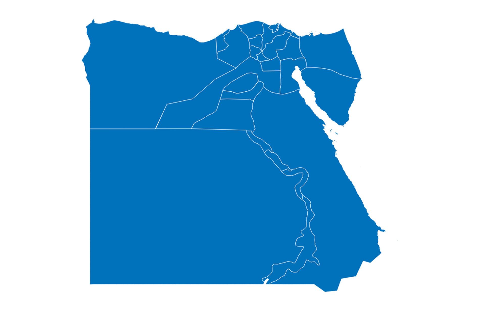

# Pin it on Map  

**UNHCR Egypt**

// team // 

Note: Presentation on community mapping exercise

---

## Background
1. Initiatives <!-- .element: class="fragment highlight-current-blue" -->
1. Available Resources <!-- .element: class="fragment highlight-current-blue" -->
1. Challenges <!-- .element: class="fragment highlight-current-blue" -->
1. Why maps are needed?  <!-- .element: class="fragment highlight-current-blue" -->
1. Way Forward<!-- .element: class="fragment highlight-current-blue" -->

Note: Overview of the presentation structure. Initiaves taken with the available resources. Need of map, challenges and way forward. PLUS DEMO.

---

## Initatives
1. Data Gathering & Compilation <!-- .element: class="fragment highlight-current-blue" -->
1. Early adoption <!-- .element: class="fragment highlight-current-blue" -->
	* Database 
	* Network Graph 
	* Static Maps 

Note: Parallel initiatives in PI, CBP and ODM. Organisation/service DB in PI. Community Mapping Exercise in CBP. Population mapping in ODM. Database repo. Early adoption examples.

----

Note: Static Map. CBOs in 6th of October. 

----

Note: Dynamic Map. Second iteration on Google Maps. More features. Explain of level of details of Hospital in Challenge slide.

----

Note: Interconnectedness of organisation in respect to work area.

---

## Available Resources
1. ProGres <!-- .element: class="fragment highlight-current-blue" -->
1. Units <!-- .element: class="fragment highlight-current-blue" -->
1. HDX, CAPMAS <!-- .element: class="fragment highlight-current-blue" -->
1. Partners <!-- .element: class="fragment highlight-current-blue" -->

Note: Progres fundamental data resources. The more finer data, the more accurate the analysis. Available Community data, service data, youth centers, police, hospital. In future - school, health centers, legal services. HumDataX since July 2014. OCHA manages HDX. Partner example from TdH/CRS.
----

----

----

---

## Challenges
1. Inconsistant (map/code)<!-- .element: class="fragment highlight-current-blue" -->
1. Inadequate (level of details)<!-- .element: class="fragment highlight-current-blue" -->
1. Data Quality (bad/missing data)<!-- .element: class="fragment highlight-current-blue" -->
1. Time consuming (cleaning/wraggling) <!-- .element: class="fragment highlight-current-blue" -->

Note: Changing boundaries of Governorates and Districts. Data at district vs governorate level - too detailed (TdH Hospital) vs too little data (schools in governorates). Across the agency data is maintained in different structure - matching them is time consuming. 

----

#### Egypt (Old)

Note: UNHCR geo database
----

#### Egypt (OCHA)

----

#### Egypt (CAPMAS)

----

### Greater Cairo (OCHA)

----

### Greater Cairo (CAPMAS)

---

## Why Map?

1. Gaining Better Insight <!-- .element: class="fragment highlight-current-blue" -->
1. Spatial Analysis<!-- .element: class="fragment highlight-current-blue" -->
1. Resource Allocation<!-- .element: class="fragment highlight-current-blue" -->

Note: Data is beautiful, and geographic data is even more visual and pattern. Data now has a location component - integrating static and geo-spatial data in a dynamic map

----

### DEMO

---

## Way Forward

---

